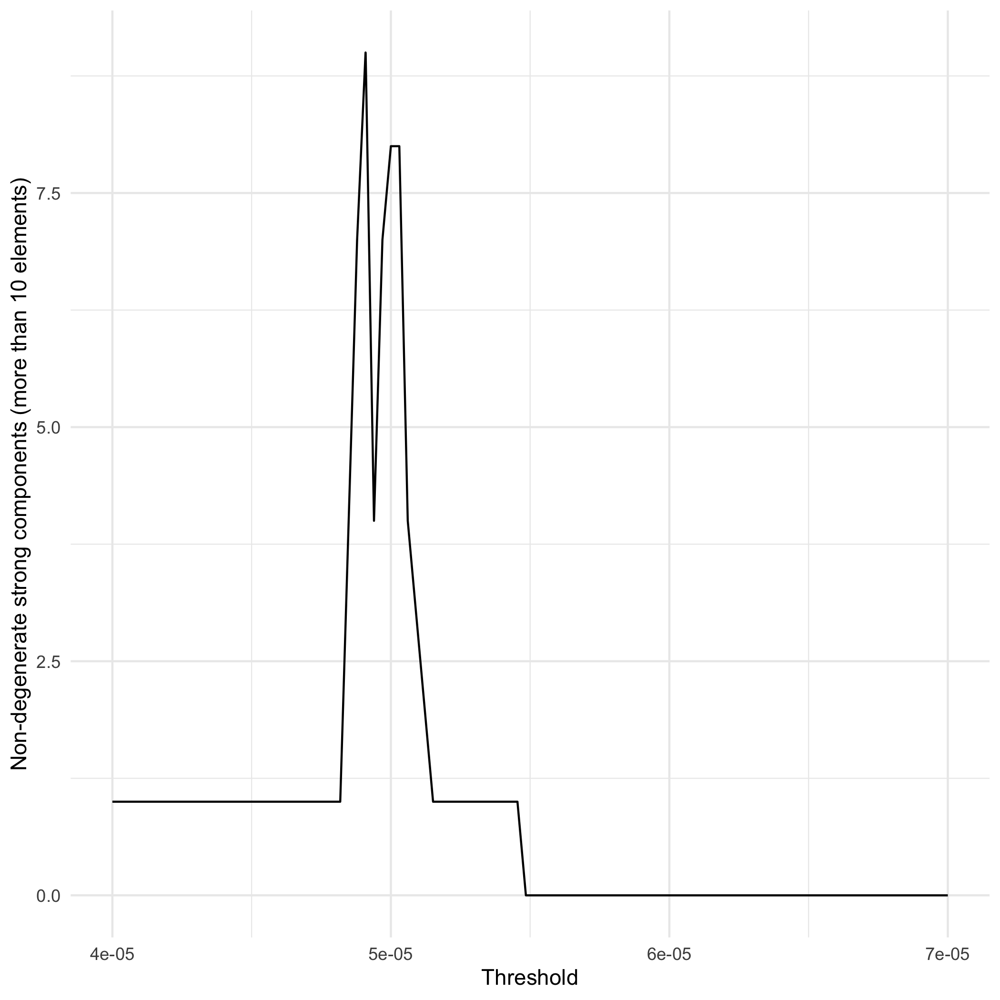

```{r echo = FALSE}
xaringanExtra::use_panelset()
```

# <br>The route this talk will take

<br>
## A cross-section of current graph clustering (community detection)

--

<br>
## A example in population-scale human mobility

--

<br>
## A motivation for directed graph clustering

--

<br>
## Proposed algorithm and early results

---

# <br> A quick overview of graph clustering

Let $G(V, E)$ be an undirected, graph consisting of the set of vertices $V$, the set of edges $E$.

```{r warning = FALSE, message = FALSE, fig.align = "center", out.width="50%"}
library(igraph)
g <- erdos.renyi.game(10, 0.20, "gnp")
plot(g)
```

---

# <br> A quick overview of graph clustering

$G(V, E)$ can be represented as an adjacency matrix 
$A \in \mathbb{R}^{|V| \times |V|}$ where $A_{i,j} = A_{j,i} \in \mathbb{R_{\geq 0}}$

```{r}
as_adjacency_matrix(g)
```

---

# <br>Community detection with modularity

<br>

Let $d_i$ the degree of vertex $i$, with community set $|C|$ and 
$S$ is an $|V| \times |C|$ 
matrix such that $S_{ij} = 1$ if node $i$ belongs to community $j$ and $0$ 
otherwise. Then we can define the modularity function as:


$$Q = \frac{1}{2|E|} \sum_{i, j = 1}^{|V|} \sum_{c = 1}^ {|C|} \left[ A_{ij} - \frac{d_i d_j}{2|E|} \right] S_{ic} S_{jc}$$

Observe that every row of the modularity matrix must sum to unity since the graph is divided into $|C|$ non-overlapping communities. Thus, we have the normalization constraint that $S^TS = N$ where $N \in \mathbb{R}^{|C| \times |C|}$ is a diagonal matrix with each entry $N_{ii}$ representing the number of nodes belonging to community $C_i$

---

# <br>Community detection with modularity

We can rewrite the discrete modularity optimization problem in a matrix form as 

$$\underset{S}{\text{max }} \ Tr(S^TBS)  \text{ s.t. } S^TS = N$$

where $B$ is the real symmetric matrix with elements

$$B_{ij} = A_{ij} - \frac{d_i d_j}{2|E|}.$$
```{r fig.align='center', echo = FALSE, out.width="45%"}

```
---

# <br>Application: Population-scale human mobility

<br>

```{r fig.align='center', echo = FALSE, out.width="75%"}

```

---

# <br>How many towers are there?

```{r fig.align='center', echo = FALSE, out.width="75%"}

```

---

# <br>Mobility communities in Connecticut

<br>

```{r fig.align='center', echo = FALSE, out.width="75%"}

```
---

# <br>What are the areas for improvement?

<br>

--

### Mobility is not symmetric

--

<br>
### It doesn't always tell us where people are going

--

<br>
### Mobility patterns change during the day

---

# <br>Proposed approach

<br>
--

###1. Find the strong components.

<br>
--

###2. Make the matrix hallow normalize the directed weights so that out-degree weights sum to one.

<br>
--

###3. Calculate the steady-state probabilities.

<br>
--

###4. Remove vertices with a the steady-state probability below a threshold.

<br>
--

###5. The strong components of the remaining vertices are the clusters.


---

# <br>Calculating the steady-state probability

<br>

Let $P \in \mathbb{R}^{|V| \times |V|}$ be the probability transition matrix 
where $p_{ij}$ is the probability of transitioning from vertex $v_i$ to $v_j$.

$$P =
  \left[ {\begin{array}{cc}
    p_{11} & p_{12} & ...\\
    p_{21} & p_{22} & ...\\
    \vdots & \vdots & \ddots
  \end{array} } \right]$$

The steady-state probability is the solution to $\pi$ in the equation

$$ \pi =  P \pi$$
subject to the constraint $\sum_{i = 1}^{|V|} \pi_i = 1$ and $\pi_i >= 0 \ \forall i \ \in [1, |V|]$. Or, more simply

$$\left[
\begin{array}{c}
\pi \\
\mathbf{1}
\end{array}
\right]=
\left[
\begin{array}{c}
P \\ 
\mathbf{1}
\end{array}
\right]
\begin{array}{c}
\pi
\end{array}$$

---

# <br> Human mobility during east coast early morning (7-9)

```{r fig.align='center', echo = FALSE, out.width="65%"}

```

---

# <br>Strong components at thresholds

```{r fig.align='center', echo = FALSE, out.width="65%"}

```

---

# <br>R packages

<br>


### It is available at [https://github.com/kaneplusplus/graphmoblity](https://github.com/kaneplusplus/graphmobility)

<br>

### For checking data try  [https://github.com/kaneplusplus/checkin](https://github.com/kaneplusplus/checkin)

--
<br>

## Thanks!